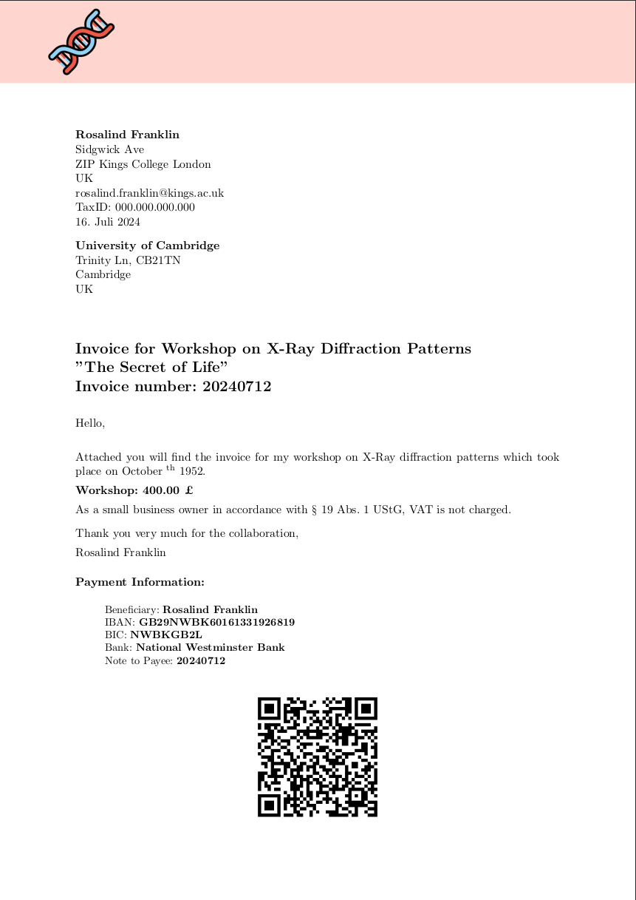

# Invoice Generator with EPC Payment QR Code

This project is an Invoice Generator that creates an invoice with an EPC payment QR code using the `segno` Python library. The invoice is generated as a PDF using LaTeX.



## Features

- Generate professional invoices in PDF format
- Include EPC payment QR codes for easy payments
- Customizable invoice details via `invoice_details.md`
- Two versions available: English (`invoice_generator_EN.py`) and German (`invoice_generator_DE.py`)

## Prerequisites

- Python 3.6 or higher
- LaTeX distribution (e.g., TeX Live, MiKTeX)

## Installation

1. Clone the repository:
    ```sh
    git clone https://github.com/yourusername/invoice-generator.git
    cd invoice-generator
    ```

2. Create a conda environment from the environment YAML file:
    ```sh
    conda env create -f environment.yml
    ```

3. Activate the conda environment:
    ```sh
    conda activate invoice-generator
    ```

4. Ensure LaTeX is installed on your system. For TeX Live:
    ```sh
    sudo apt-get install texlive-full  # On Debian/Ubuntu
    ```

5. Fill in your payment information and invoice text in the `invoice_details.md` file.

## Usage

1. Ensure your conda environment is activated:
    ```sh
    conda activate invoice-generator
    ```

2. Run the English version of the invoice generator:
    ```sh
    python invoice_generator_EN.py
    ```

3. Or, run the German version of the invoice generator:
    ```sh
    python invoice_generator_DE.py
    ```

4. The generated invoice will be saved as `invoice.pdf` in the current directory.

## Configuration

- **invoice_details.md**: This file should be filled with the necessary details for your invoice. The details should include payment information, such as the recipient's bank details, amount, and other relevant text.

## Contributing

Contributions are welcome! Please fork this repository and submit pull requests with your improvements.

## License

This project is licensed under the MIT License. See the `LICENSE` file for details.

## Acknowledgements

- [Segno](https://github.com/heuer/segno) for generating QR codes
- [LaTeX](https://www.latex-project.org/) for document preparation
